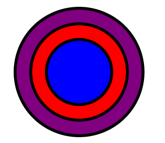

#Modular CSS

##Learning Objectives

* Abstract your styles with classes
* Design modular CSS
* Practice the challenging intricacies of CSS

###Steps

* Refer to the `index.html` inside the `starter_code` directory
* Create an external stylesheet that contains your work

###Tip

Use Chrome's developer tools to test out your styles in real time. This avoids you making changes and reloading each time to see the change.

##Exercises

For the following exercises, refer to the mini-project in [starter_code](starter_code/).

###SHOUT IT OUT!

Create a class `.shout` that uppercases the text of "Modular CSS". 

###Shadow

Create a class called `.shadow` that creates a drop shadow for the "Modular CSS" text. Make it subtle and not ugly (try blurring the shadow and using gray as the color).

###Invert

Create a class `.invert	` that flips the photo of the lady upside down.

Hint: try `transform: rotate(180deg)`

###Coloring

Create three separate classes to color the grid:

* `.red-background`
* `.blue-background`
* `.purple-background`

Make the shapes 1, 5, 9 red; shapes 2, 6, 7 blue; and shapes 3, 4, 8 purple.

###Circle

Create a class called `.circle` and add it to each shape in the grid make them all circles.

Erase all the numbers inside the circles.

*Tip: For productivity, use the `command` key and click around in sublime to spawn multiple cursors.*

###Halfsies

Create a class `.half` that will cut an element's size by 50%.

Use it to cut the `
` tag's size in half.

###Centering

Create two classes to center the title text, the lady and your grid.

You may realize that since we have to account for inline, block, and inline-block elements they have different ways of being centered. A a result you will need two separate classes that we may choose to name:

* `.middle` (for block elements)
* `.center` (for inline or inline-block elements)

Tip: CSS will mostly use `text-align` (center children) or `margin` (center) for horizontally centering things. Here's a helpful [reference guide](https://css-tricks.com/centering-css-complete-guide/) to centering things for more help.

###Bullseye

Make a bullseye using three circle shapes as such:

Hint: Use absolute and relative positioning, z-index, and some of your existing classes.
